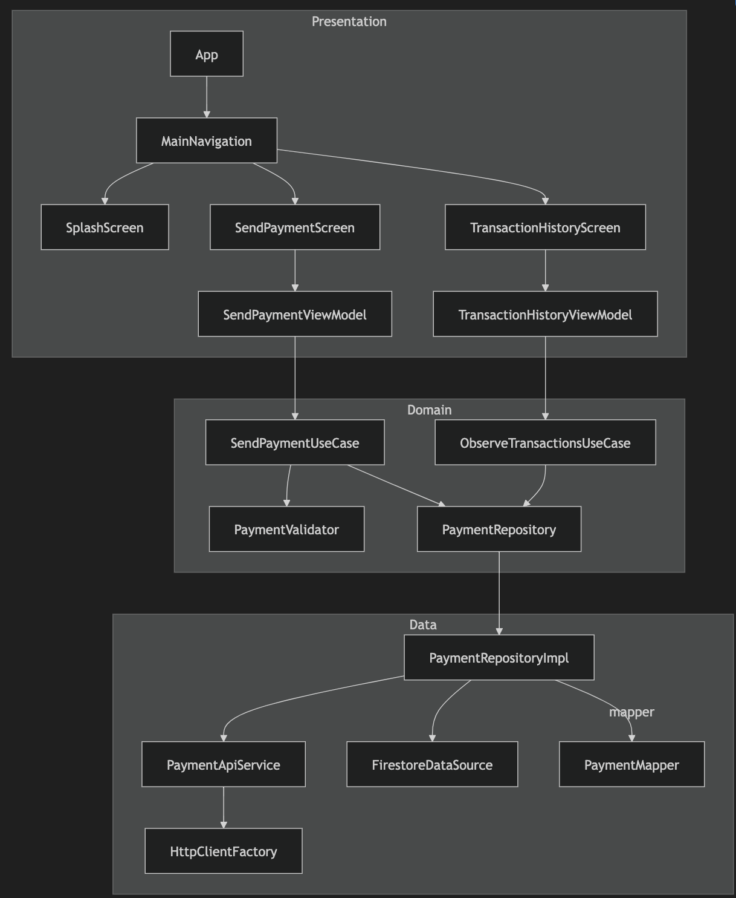

# Cashi FinTech App

A modern, cross-platform Android and iOS Kotlin Multiplatform (KMP) application for sending and receiving payments.

This project was built using **Compose Multiplatform** for the entirely shared UI, **Ktor** for networking, **Koin** for dependency injection, and clean architecture principles. It currently connects to a local Mock API server.

---

## � App Preview
https://github.com/user-attachments/assets/f80d55c4-a73e-49bc-a8b9-2ce325a65294

---

## �🌍 Cross-Platform Power of Kotlin Multiplatform (KMP)

This application leverages **Kotlin Multiplatform (KMP)** to achieve maximum code reuse without sacrificing native performance or access to platform-specific APIs. By sharing the business logic, data models, networking code, and even the UI (via **Compose Multiplatform**), we gain:

- **100% Shared Business Logic**: The Domain and Data layers are written once in Kotlin and run natively on both Android and iOS. This prevents logic discrepancies between platforms.
- **Shared UI**: Using Compose Multiplatform, the Presentation layer is also shared. The UI looks perfectly consistent while still compiling down to native iOS UI via `Compose UIViewController`.
- **Native Performance**: Unlike hybrid frameworks (React Native, Flutter) that use a bridge or custom rendering engine, Kotlin code gets compiled directly to JVM bytecode for Android and LLVM native machine code for iOS.
- **Platform Interoperability (`expect`/`actual`)**: When we need platform-specific implementations (e.g. Firebase Firestore), KMP provides the `expect`/`actual` mechanism. In this app, `expect class FirestoreDataSource` defines the contract in `commonMain`, while the native Google/Apple Firebase SDKs actually execute the network calls behind the scenes in `androidMain` and `iosMain`.

---

## 🏗 Architecture

The app is structured into a strictly separated Clean Architecture:



1. **Domain Layer (`domain/`)**: Contains pure Kotlin business logic (`Transaction`, `PaymentRequest`, `Currency`). Mappers and Use Cases (`SendPaymentUseCase`, `ObserveTransactionsUseCase`).
2. **Data Layer (`data/`)**: Concrete implementations of the repositories. Houses the `PaymentApiService` using **Ktor Client** for HTTP networking and `FirestoreDataSource` for data persistence.
3. **Presentation Layer (`presentation/`)**: The shared UI layer powered by **Compose Multiplatform**. Contains our MVI-style `ViewModels` and completely native-feeling UI screens (Splash, Send Payment, Transaction History) built with Material 3.

---

## 🚀 Getting Started

### 1. The Mock API Server (Backend)

The project includes a lightweight local Ktor server to simulate payment processing. 

**To start the mock API:**
1. Open a terminal at the root of the project.
2. Run the server using the Gradle wrapper:
   ```bash
   ./gradlew :mock-api:run
   ```
3. The server will start on `http://localhost:3000`.

*Note: The mock API strictly validates that emails are properly formatted, amounts are > 0, and currencies are either `USD` or `EUR`.*

### 2. Running the Mobile App

Because setting up a local server can be tedious for quick UI testing, the app defaults to working entirely in-memory using a dummy delay.

**If you want the app to actually hit the local Mock API Server:**
1. Open `mobileapp/composeApp/src/commonMain/kotlin/me/thankgodr/fintechchallegeapp/data/remote/PaymentApiService.kt`.
2. Find the companion object.
3. Change `USE_LOCAL_MODE` to `false`:
   ```kotlin
   private const val USE_LOCAL_MODE = false
   ```
4. Ensure `BASE_URL` points to the URL where the mock API server is running. *(Note: For Android Emulators running on the same machine as the server, use `"http://10.0.2.2:3000"`)*

**To build and run the Android app:**
1. Open **Android Studio**.
2. Make sure you have the **Kotlin Multiplatform Mobile (KMM)** plugin installed.
3. **Important:** Ensure you download your `google-services.json` from Firebase and place it in the `mobileapp/composeApp/` directory. Without this file, the Android app will crash on launch!
4. Select **File > Open**, and select the `mobileapp` directory inside this project.
5. Let Gradle sync naturally.
6. Select the `composeApp` run configuration at the top toolbar and hit **Run** on your emulator or physical device.

---

## 🧪 Testing

The project has comprehensive test coverage, ranging from unit tests to UI automation and API load tests.

### 1. Unit Tests
Located in `composeApp/src/commonTest/`. Tests ViewModel logic, Use Cases, Repository error handling, and string formatting utilities using **Kotlin Test** and **Turbine** for Flow assertions.
```bash
./gradlew :composeApp:testDebugUnitTest
```

### 2. Android Instrumented UI Tests (UI Automator)
The project includes actual on-device UI tests using **UI Automator**, located in `composeApp/src/androidInstrumentedTest/`. These tests launch the app, interact with our Compose Multiplatform components via mapped `testTag` IDs, and verify end-to-end flows.
```bash
./gradlew :composeApp:connectedDebugAndroidTest
```

### 3. BDD Tests (Cucumber)
Located in `composeApp/src/commonTest/`. Features defined in Gherkin syntax mapped to UI states.

### 4. Appium UI Tests (Android/iOS)
The Compose Multiplatform UI has been instrumented with `Modifier.testTag()`.
In `App.kt`, we have enabled `testTagsAsResourceId = true`, which exposes these exact tags to **Appium** (via XCUITest on iOS and UIAutomator2 on Android) using the same selectors across both platforms.

### 5. API Load Testing (JMeter)
A JMeter Test Plan is included to load test the mock API.
- File: `mock-api/mock_api_load_test.jmx`
- Configuration: Simulates 5 concurrent users looping 10 times, generating randomized emails and payment amounts.
- **To run headless:**
  ```bash
  jmeter -n -t mock-api/mock_api_load_test.jmx -l mock-api/results.jtl
  ```
